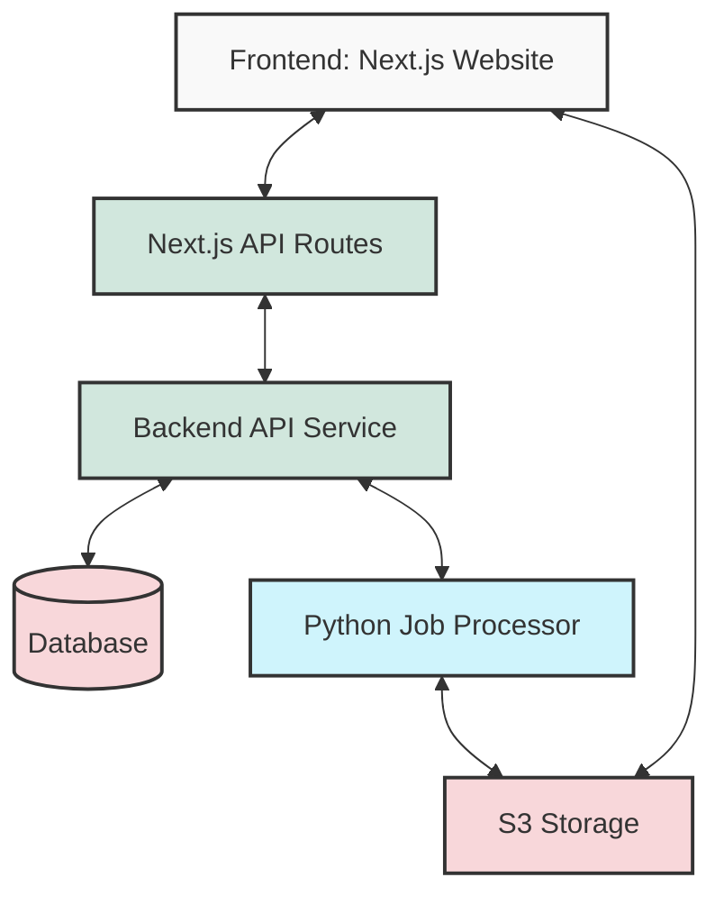
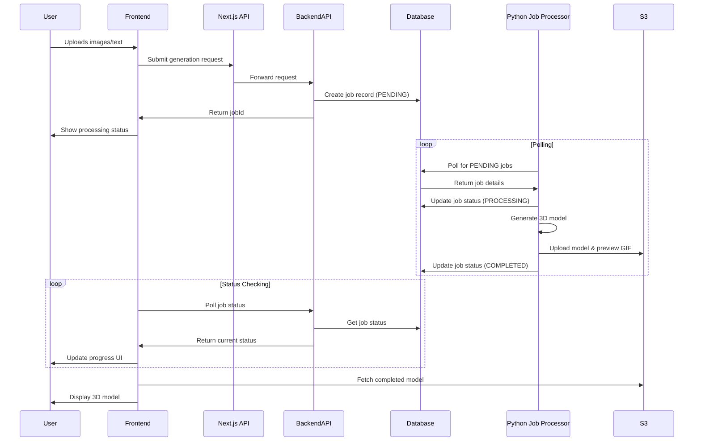
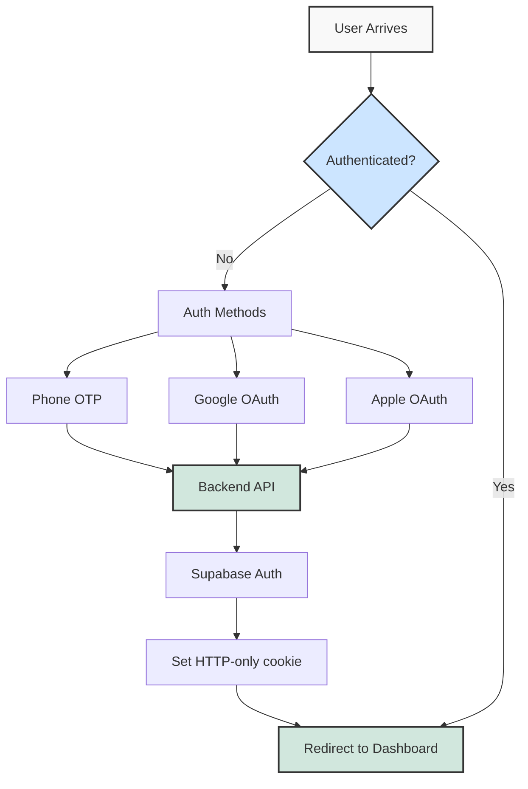
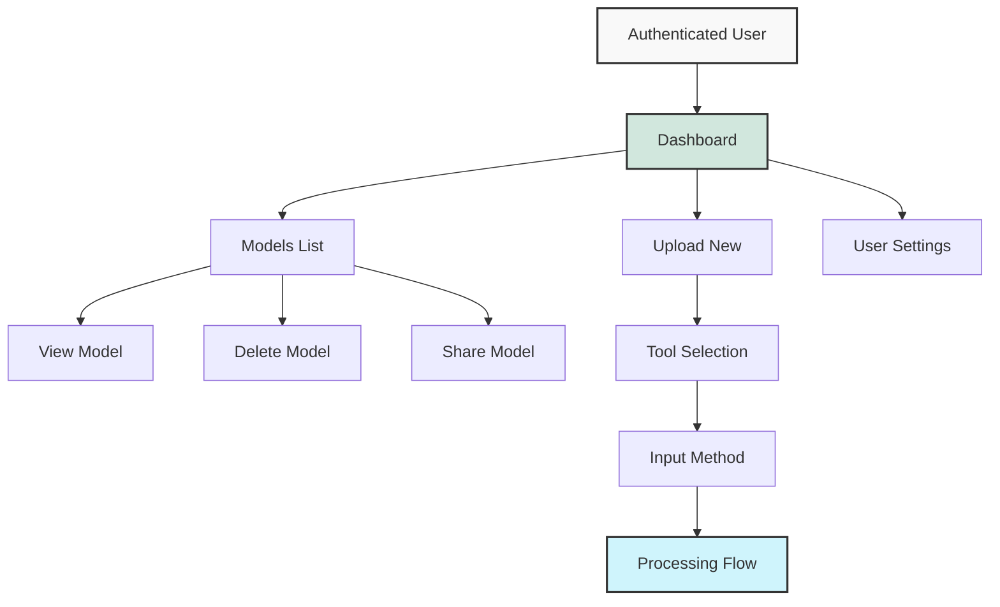
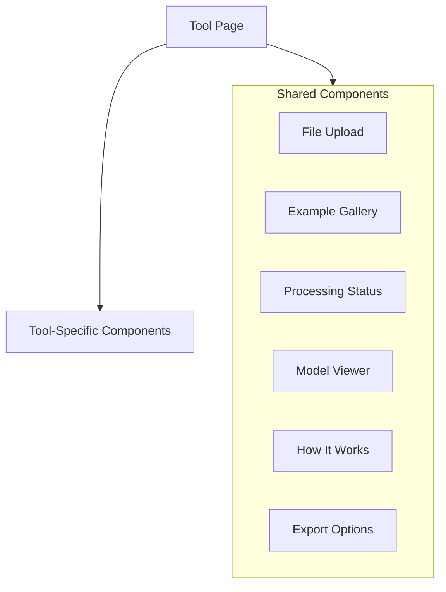
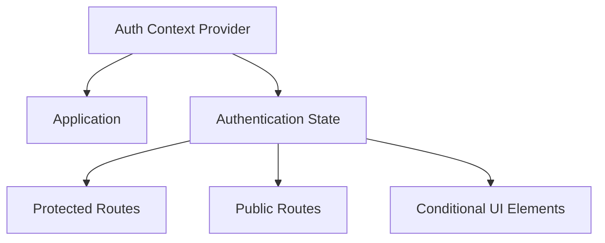
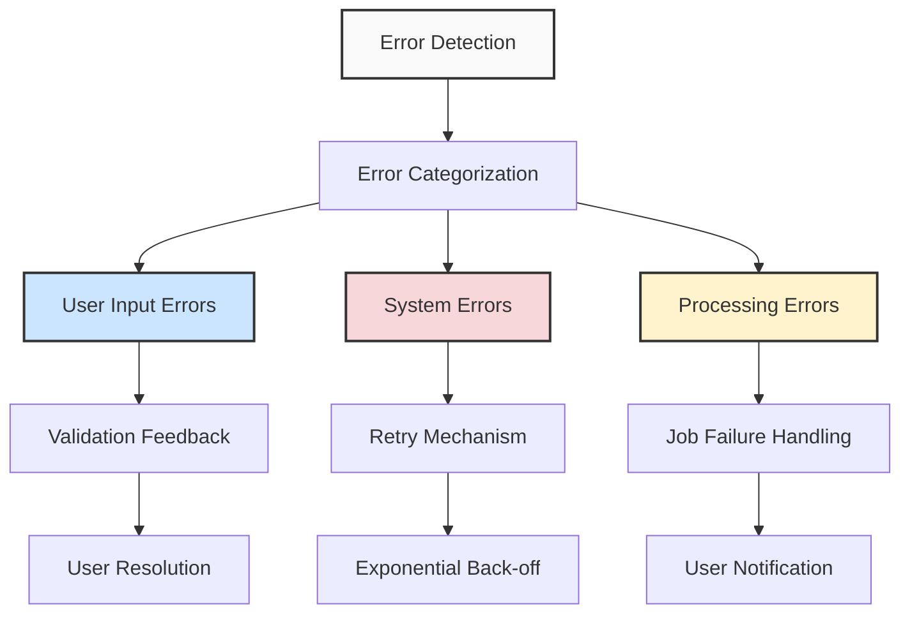

# System Patterns: Mesh Reality

## Overall Architecture

Mesh Reality follows a distributed microservices architecture with three main components:

1. **Frontend (mesh-reality-website)**
   - Next.js 14 web application
   - User interface for all tools and services
   - Client-side model viewing with Three.js
   - Authentication flow integration

2. **Backend API (mesh-reality-backend)**
   - RESTful API service
   - User and model data management
   - Authentication and authorization
   - Job management API

3. **Python Job Processor (mesh-reality-hunyuan3d)**
   - Asynchronous processing of 3D generation tasks
   - Machine learning model integration
   - Background job processing
   - Media processing (images, GIFs, etc.)

## Core Pattern: Job Queue Architecture

The system employs a job queue architecture for handling computationally intensive 3D model generation:

### Benefits of Job Queue Pattern
- Decouples request handling from intensive processing
- Prevents API timeouts during long-running operations
- Enables real-time status updates to users
- Allows for background processing of resource-intensive tasks
- Facilitates better error handling and recovery
- Provides a 360-degree preview GIF while full model loads

## Authentication Flow

Authentication is backend-owned; frontend uses session cookie.

### Authentication Components
- **Backend**: Session, login, logout, OAuth redirect, phone OTP (Supabase server-side)
- **Phone Auth Flow**: Backend calls Supabase OTP/verify, sets cookie
- **OAuth**: Backend redirects to Supabase → Google/Apple; callback to frontend then POST token to backend
- **Protected Routes**: Dashboard layout checks backend session (cookie)

## Data Flow Patterns

### Model Generation Flow

```mermaid
flowchart LR
    Input[User Input] --> Validation[Input Validation]
    Validation --> JobCreation[Job Creation]
    JobCreation --> Queue[Processing Queue]
    Queue --> Generation[Model Generation]
    Generation --> Preview[Preview Creation]
    Preview --> Storage[S3 Storage]
    Storage --> Viewer[3D Viewer]
    
    style Input fill:#f9f9f9,stroke:#333,stroke-width:2px
    style Generation fill:#cff4fc,stroke:#333,stroke-width:2px
    style Preview fill:#cff4fc,stroke:#333,stroke-width:2px
    style Storage fill:#f8d7da,stroke:#333,stroke-width:2px
    style Viewer fill:#d1e7dd,stroke:#333,stroke-width:2px
```

### User Dashboard Flow

## UI Component Architecture

The frontend follows a component-based architecture with several key patterns:

### Shared Component Pattern

Tools share common UI components to maintain consistency:

### Authentication Context Pattern

## Error Handling Patterns

## Key Design Patterns Used

1. **Repository Pattern**: For data access abstraction
2. **Service Layer Pattern**: For business logic encapsulation
3. **Job Queue Pattern**: For asynchronous processing
4. **Context Provider Pattern**: For state management in React
5. **Middleware Pattern**: For request/response processing
6. **Factory Pattern**: For creation of different 3D generation strategies
7. **Strategy Pattern**: For swapping 3D generation algorithms
8. **Observer Pattern**: For status updates and notifications

These system patterns form the architectural foundation of Mesh Reality, enabling a scalable, maintainable, and robust platform for 3D content creation.
